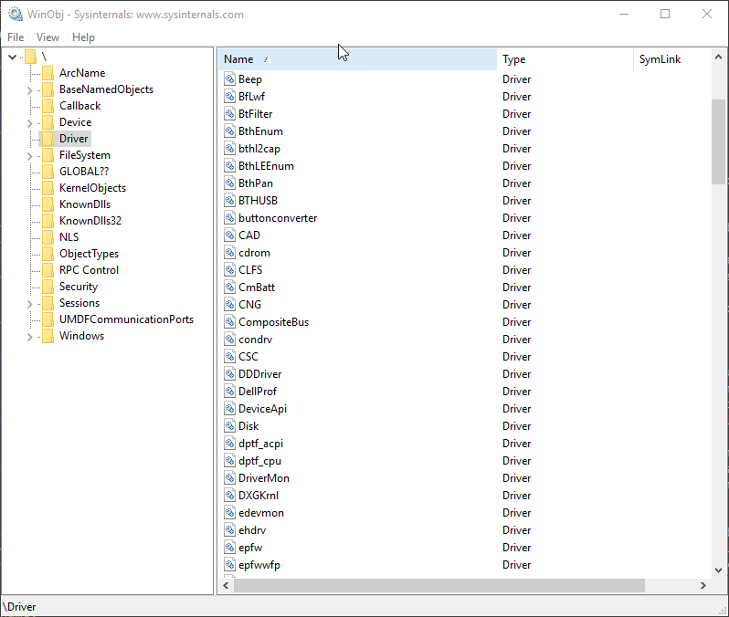
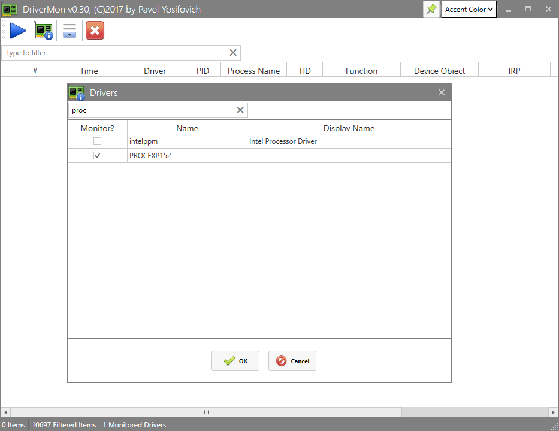
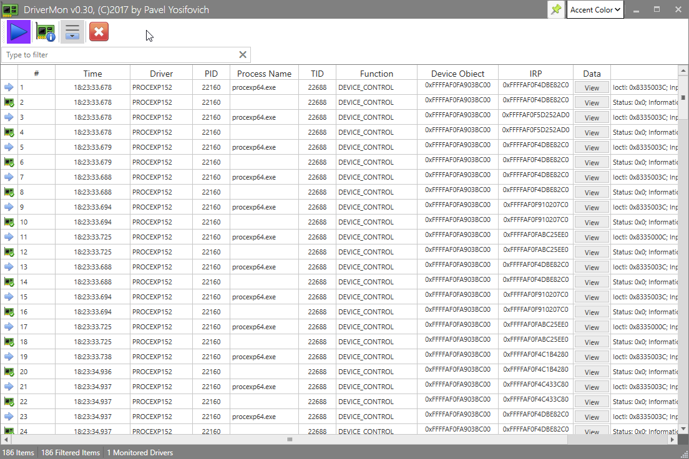
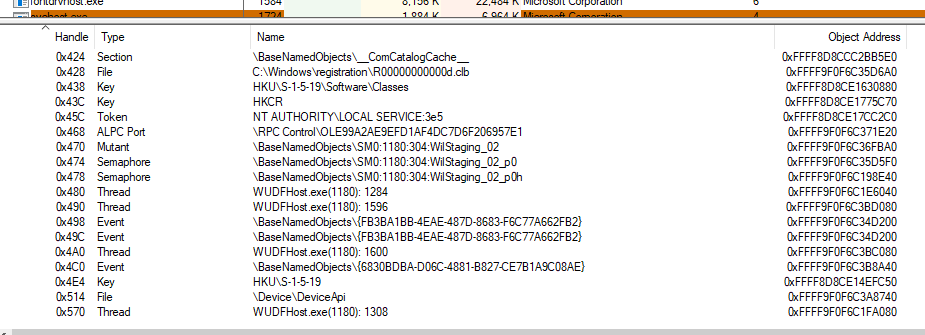
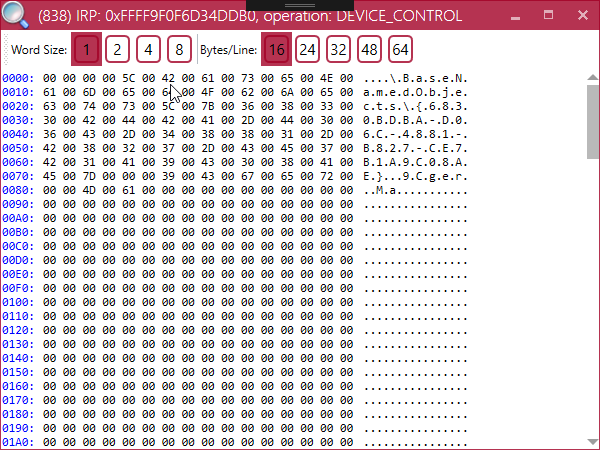

# Driver Introspection with DriverMon
In the past few weeks I've been working in my non-existent spare time on [DriverMon](https://github.com/zodiacon/DriverMon) - a driver monitoring tool for Windows. The tool is far from complete, but it's already quite useful. In this post I'll describe how to use it and some of the challenges of building such a tool.

Initially I wanted to be able to track every [I/O Request Packet](https://docs.microsoft.com/en-us/windows-hardware/drivers/gettingstarted/i-o-request-packets) (IRP) targeted to monitored devices. The term "devices" here is important, as the Windows I/O system is device-centric rather than driver-centric. That is, requests are delivered to devices, not drivers. A device can be thought of as a communication endpoint, while the driver just provides the actual functionality (code) to execute for any device under its control. For example, a system with two identical network cards will have two distinct device objects representing each card, since each card has distinct I/O ports, memory registers and interrupt line. But the driver is single, providing the behavior.

Because of this arrangement, filter drivers are really filtering device requests, layering on top of devices. For example, a network filter driver can choose to layer on top of one network card but not the other.

Properly written filter drivers that can intercept IRPs are non-trivial to write because of some idiosyncrasies of the I/O manager, and some tricky parts of handling Plug & Play IRPs (if targeting such a device). Furthermore, such a driver should be properly registered and a restart is usually needed so it's loaded in the correct order. This is highly inconvenient for a monitoring tool. A more dynamic option is to use the [IoGetDeviceObjectPointer](https://msdn.microsoft.com/EN-US/library/windows/hardware/ff549198(v=vs.85).aspx) function to dynamically locate a device object of interest if it's named. Then after creating a filter debice object and doing some required initialization, a call to IoAttachDeviceToDeviceStack attached the new device on top of the target device and filtering commences. However, one caveat here is that the new device goes to the top of the device stack, even if the actual target is not at the top; this is an I/O system rule.

A different approach, which I have used in DriverMon is to hook driver code directly without messing around with device objects explicitly - the hooked functions are called for every device managed by that driver. This is not an officially supported method of filtering, and I actually suspected that some built-in drivers may be protected from such hooks by the kernel's patch protection ("PatchGuard"). Luckily, for now I haven't encountered this for the drivers I have tested against, including some "low-level" drivers such as AFD and ACPI.

The hooks are based around the major function pointer array that every driver object holds, which point to the dispatch routines for all operations such as create, close, read, write, device control, plug & play, power, and so on. Hooking really means changing the pointers to these function to point to my driver while saving the original pointers so that the driver can forward the request once their contents has been extracted. Hooking a driver means locating it by name (without going through a device name). Here's a snippet from the *AddDriver* function:
```C++
UNICODE_STRING name;
RtlInitUnicodeString(&name, driverName);
PDRIVER_OBJECT driver;
auto status = ObReferenceObjectByName(&name, OBJ_CASE_INSENSITIVE, nullptr, 
    0, *IoDriverObjectType, KernelMode, nullptr, (PVOID*)&driver);
if (!NT_SUCCESS(status))
	return status;
//...

for (int i = 0; i <= IRP_MJ_MAXIMUM_FUNCTION; i++) {
	globals.Drivers[index].MajorFunction[i] = static_cast<PDRIVER_DISPATCH>(
		InterlockedExchangePointer((PVOID*)&driver->MajorFunction[i], 
		DriverMonGenericDispatch));
}

```
The undocumented (but exported) function **ObReferenceObjectByName** is used to retrieve the [DRIVER_OBJECT](https://msdn.microsoft.com/EN-US/library/windows/hardware/ff544174(v=vs.85).aspx) pointer to the named driver. All named drivers reside under the **Driver** directory in the object manager, as can be seen in this [WinObj](https://docs.microsoft.com/en-us/sysinternals/downloads/winobj) screenshot:


Of course not every driver in that list is a traditional driver with IRPs and such. Some of these are specialized, such as Win32k (the kernel mode component of the Windows subsystem, handling Windowing and GDI), so hooking such drivers has no real effect as their dispatch routines are not really used.

The function *DriverMonGenericDispatch* is the recipient of all calls to the hooked driver. This function collects the information within the request, stores it in a cyclic buffer and signals an event object passed earlier by the user mode client to indicate new data is available.

For synchronous requests that complete immediately, the function also collects the results, writes to the buffer and signals the event. For demo purposes, let's track one relatively simple driver with DriverMon and see what we can learn.

I'll use the well-known [Process Explorer](https://docs.microsoft.com/en-us/sysinternals/downloads/process-explorer) tool from Sysinternals, since it has a driver that provides information and functionality to its client that is difficult or impossible to obtain from user mode.
We'll run Process Explorer with admin privileges and then fire up DriverMon. Click on the *Drivers* button and search for "ProcExp152" and check it:

*PROCEXP152* is the current driver name for Process Explorer. Click OK to accept the dialog. Now click the "play" button and you should see a bunch of requests:



The blue arrow icon indicates incoming requests and the hardware icon indicates synchronous response. We can see all requests are using the [DeviceIoControl](https://msdn.microsoft.com/EN-US/library/windows/desktop/aa363216(v=vs.85).aspx) function where the process ID is 22160. Looking at Process Explorer itself this is the procexp64.exe process, which is indeed the 64-bit version of Process Explorer. The "View" button allows looking at the passed buffers.

Here's an example request that happened when I switched to a new process in the processes view and the lower pane should show handles:

Here's the view in Process Explorer:



The process number is 0x49c. This is the first 4-byte number in the input message. Now here's the output:



We can see the handle value 0x4c0 in the input message and the object address after that as well (0xFFFF9F0F6C3B8A40). The response shows the name of that Event object as shown in process explorer. Some leftovers from previous messages is there as well. Notice the string ends with a zero (null) character.

I'll it to the interested reader to figure out other arguments to this and (other) messages.

# What's missing in the tool?

From the driver's perspective the most important missing feature is the result of asynchronous requests. In "normal" filtering, this would be done with an I/O completion routine (IoSetCompletionRoutine), but with hooking a custom completion is needed to hook any existing completion routine. Seems simple enough, but I discovered that from time to time the system crashes with "multiple IRP complete requests", which is pretty tough to diagnose (the driver itself does not complete any IRP, of course), so there is something wrong there. Currently this feature is disabled until I figure out what I'm doing wrong.

The UI part can always be improved with custom filters, search, saving and loading the data to CSV or XML, etc. It's open source, so if WPF is your thing, go ahead and enhance the tool.

Happy monitoring!