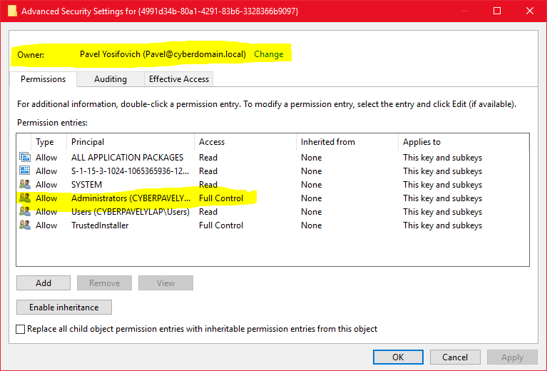
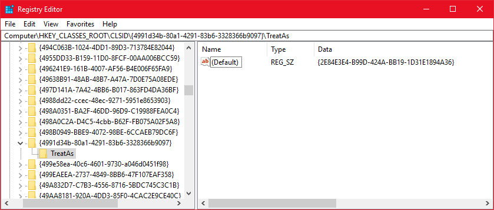

# Hooking COM Classes
There are some common scenarios that benefit from the ability to hook operations. The canonical example is hooking Windows API functions for debugging purposes, or for malware detection. In this scenario, some DLL is injected into a target process and then hooks relevant functions. There are several ways to do that, but that is not the focus of this post; the interested reader can search the web for more information.
In the Component Object Model (COM) world, things are not so easy. Since COM is object based, it's not generally possible to get the address of a COM interface method, as it is not exported directly can cannot be discovered by calling GetProcAddress or something similar.

Furthermore, even if somehow a method's address is discovered, hooking would require injecting some code into the target process, which may not be trivial or even impossible in some cases (such as protected processes).

COM provides another hooking, or rather redirection, mechanism. This mechanism provides a way to redirect one CLSID to another CLSID. The MSDN documentation calls this ability "emulation", as one class can (try) to emulate another. This opens up the possibility to redirect one class to another without any need for injection and method-based hooking.

Let's look at a concrete example. The Background Intelligent Transfer Service (BITS) in Windows provides an asynchronous download/upload service with progress notifications, automatic resumes on networking flakiness and so on. On way malware can download its payload is through BITS rather than directly. Downloading directly makes the malware more exposed to anti-malware tools. Downloading through BITS distances the malware from the downloaded payload and makes it more difficult to recognize that any wrong doing has occurred.

Since BITS is based on COM, "emulation" can be used to "hook" any BITS work where the intent and the result of BITS operations can be obtained.

The key to get this to work is the [CoTreatAsClass](https://msdn.microsoft.com/EN-US/library/windows/desktop/ms693452(v=vs.85).aspx) API that adds a **TreatAs** key to the original key with a value that points to the alternate CLSID. This is all-or-nothing proposition, though: there's no way to redirect certain requests only, but any COM activation request (such as through [CoCreateInstance](https://msdn.microsoft.com/en-us/library/windows/desktop/ms686615(v=vs.85).aspx)) are redirected to the *TreatAs* CLSID instead. 

Which CLSID(s) should be hooked? In the case of BITS, it's easy, since there's only one - the BackgroundCopyManager, which is the root factory object that needs to be created to use BITS. You may think a better CLSID to target is the one for actual Job objects created by BITS - but this won't work, since there is no such CLSID. Like many COM-based APIs, only a few objects are actually createable using the COM public activation APIs and have CLSIDs. Others are created indirectly by methods without going through the COM activation mechanism (and consequently through the registry). 
There's a good reason for that: control. Without a CLSID, a BITS Job cannot be created "out of the blue" without the BITS manager knowing about it.

Here's the code needed to register an alternate class for intercepting BITS requests:
```
HRESULT hr = ::CoTreatAsClass(
   __uuidof(BackgroundCopyManager), 
   __uuidof(FakeBitsManager));
```
The **FakeBitsManager** is a COM class I created that needs to implement the same interfaces as the original object ([IBackgroundCopyManager](https://msdn.microsoft.com/EN-US/library/windows/desktop/aa363050(v=vs.85).aspx)); otherwise, all BITS operations on the machine will fail!

Note that specifically for BITS the above *CoTreatAsClass* call will fail with access denied, even if called from an elevated process. The reason is that this key under HKCR\CLSID\{4991d34b-80a1-4291-83b6-3328366b9097} is owned by *TrustedInstaller* and it does not allow tampering, not even to the System account! However, an administrator can exercise the Take Ownership privilege and become the new owner of the key, thus having the power to change its permissions. For this experiment, I did just that with the registry permissions editor:



Where do we call *CoTreatAsClass*? It should be done in some installer, which can be a simple batch or PowerShell script that can make the correct settings using Registry functions directly.

The result is shown here:


Here's a COM class implemented with ATL that sets to intercept the BITS manager class by implementing *IBackgroundCopyManager* (and IUnknown):
```
class ATL_NO_VTABLE CFakeBitsManager :
	public CComObjectRootEx<CComSingleThreadModel>,
	public CComCoClass<CFakeBitsManager, &CLSID_FakeBitsManager>,
	public IBackgroundCopyManager
{
//...

    BEGIN_COM_MAP(CFakeBitsManager)
        COM_INTERFACE_ENTRY(IBackgroundCopyManager)
    END_COM_MAP()

    HRESULT FinalConstruct();

    CComPtr<IBackgroundCopyManager> m_spRealBits;

public:
    STDMETHOD(CreateJob)(
        LPCWSTR DisplayName,
        BG_JOB_TYPE Type,
        __RPC__out GUID *pJobId,
        IBackgroundCopyJob **ppJob);

    STDMETHOD(GetJob)(
        REFGUID jobID,
        IBackgroundCopyJob **ppJob);

    STDMETHOD(EnumJobs)(
        DWORD dwFlags,
        IEnumBackgroundCopyJobs **ppEnum);

    STDMETHOD(GetErrorDescription)(
        HRESULT hResult,
        DWORD LanguageId,
        LPWSTR *pErrorDescription);

};

OBJECT_ENTRY_AUTO(__uuidof(FakeBitsManager), CFakeBitsManager)
```
Only the interesting parts of the class are shown. Notice the interface map that declares support for *IBackgroundCopyManager* and the four methods that have been copied (without the comments and SAL annotations) from the **<bits.h>** header file.

Also, note the smart pointer to yet another implementation of *IBackgroundCopyManager* (m_spRealBits). This member should be initialized to the real BITS manager so we can forward requests to it - we don't want to just fail all BITS operations.

But how can we create the real BITS manager? Any creation attempt will recursively go back to our class. The answer is simple - we need to turn TreatAs off for a quick call to create the real BITS and then turn it back on:
```
HRESULT CFakeBitsManager::FinalConstruct() {
    auto hr = ::CoTreatAsClass(__uuidof(BackgroundCopyManager), CLSID_NULL);
    ATLASSERT(hr);

    hr = m_spRealBits.CoCreateInstance(__uuidof(BackgroundCopyManager));
    ATLASSERT(SUCCEEDED(hr));

    hr = ::CoTreatAsClass(__uuidof(BackgroundCopyManager), __uuidof(FakeBitsManager));
    ATLASSERT(SUCCEEDED(hr));

    return hr;
}
```
Calling *CoTreatAsClass* with a second argument of CLSID_NULL turns "emulation" off. There's a tiny window of opportunity here for other clients on the machine to get the "real" BITS. But this interval is very small and not advertised in an easy way (Registry based callbacks and ETW events will catch it), but even with this, user mode registry callbacks may not be fast enough to notice the change before it's reverted. Of course, elevated processes can revert it manually, but it's not something a typical client considers and it may not have enough permissions to do that anyway.

Now we can go ahead and implement the methods. Any non-interesting methods can simply be redirected to the real BITS manager. For example:
```
STDMETHODIMP CFakeBitsManager::GetJob(
    REFGUID jobID,
    IBackgroundCopyJob **ppJob) {
    return m_spRealBits->GetJob(jobID, ppJob);
}

STDMETHODIMP CFakeBitsManager::EnumJobs(
    DWORD dwFlags,
    IEnumBackgroundCopyJobs **ppEnum) {
    return m_spRealBits->EnumJobs(dwFlags, ppEnum);
}
```
The only interesting method is CreateJob, where we can gather information, register for progress notifications or whatever. For example:
```
STDMETHODIMP CFakeBitsManager::CreateJob(
    LPCWSTR DisplayName, BG_JOB_TYPE Type,
    GUID *pJobId, IBackgroundCopyJob **ppJob) {

    if(Type != BG_JOB_TYPE_DOWNLOAD) 
        return m_spRealBits->CreateJob(DisplayName, Type, pJobId, ppJob);

    auto hr = m_spRealBits->CreateJob(DisplayName, Type, pJobId, ppJob);
    if (FAILED(hr))
        return hr;

    // handle the successful job creation
    // register for notifications, log the download, ...

    return hr;
}
```
The example shows that for non-download jobs we simply pass the request through to the real BITS manager. On a successful download job creation, we can do whatever we need to monitor that download request.
## Conclusion
Hooking COM classes is an interesting technically that mandates further investigation