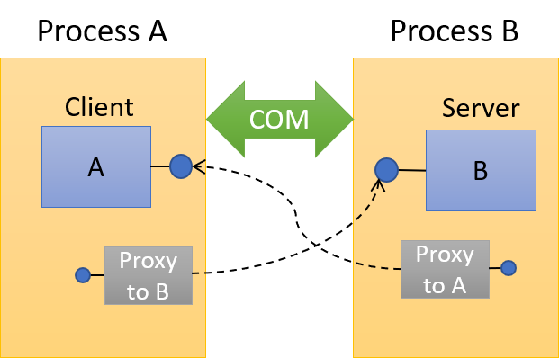
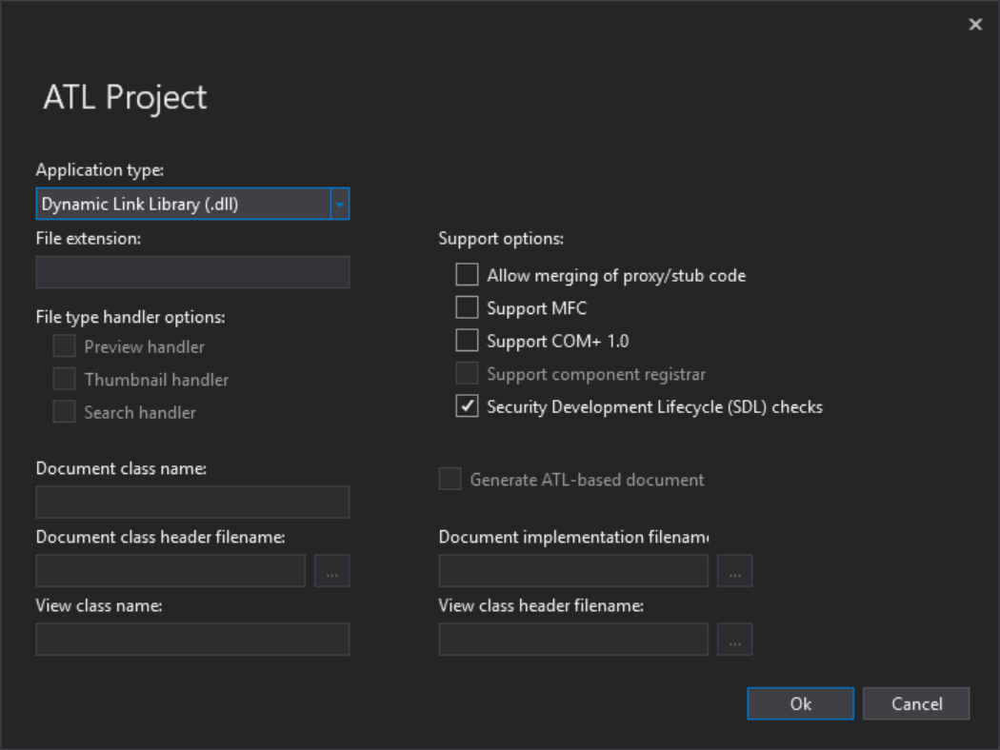
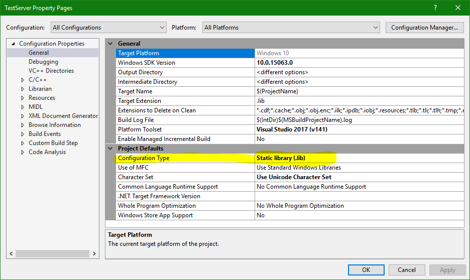

# Integrating COM IPC into Existing Executables
A few days ago at work, a requirement arouse to create some form of inter-process communication (IPC) between two cooperating processes where the source code for the executables themselves already existed, so such mechanism should integrate into the existing code as easily as possible, while providing bi-directional communication.

Several options were brought up, including pipes and sockets. The processes are services and have no UI, so Window messages were not an option. Other ideas included shared memory with notifications using kernel event objects... and then I suggested COM.

There was a brief silence and then people started murmuring things like "COM is complicated and complex", and other similar variants. The Component Object Model has some potentially complex parts, but its foundations are essentially simple. The "complex" attitude I often get whenever COM is mentioned is usually due the lack of COM understanding; we mostly fear and avoid what we don't understand.

What's wrong with the other IPC mechanisms suggested? Nothing, really, except that all these require parsing of data structures to identify the message and *that* complicates things. With COM, it's just method calls.

In this post, I'll show how to integrate COM communication into existing process code with minimal interruption and no registry usage. This is certainly not the only way to do this with COM, and the curious reader can come up with other variants.

COM has fundamentally two principles:
1. Clients program against interfaces, never concrete classes.
2. The location of the server code is not explicitly specified and typically loads dynamically.

The overall result we're aiming for is shown in the following figure:


The client and server objects are essentially interchangeable, as calls are made in both directions. Code in process A creates the "server" object, and code in process B creates the "client" object in exactly the same way as process A. This symmetry is useful, for there is no need for the two processes to synchronize their respective object creation. As always with COM in inter-process scenarios, callers get back a proxy, which we must make sure is available.

The simplest way to go when creating COM classes is to use the Active Template Library (ATL). Although the newer Windows Runtime Library (WRL) is more elegant, it lacks some small features ATL has; WRL is more suited for the Windows Runtime.

Our initial solution holds the two executable projects. We add a new ATL project, called **TestServer**, as DLL, with the default settings (all screenshots are with Visual Studio 2017 using the dark theme):



The wizard creates two projects - the actual DLL project and a second DLL project ending with "PS" - the proxy/stub DLL.

Our first task is to register the class objects themselves without using the Registry. COM supports the notion of [Registry free activation](https://docs.microsoft.com/en-us/dotnet/framework/interop/registration-free-com-interop) by using a manifest file, but I find that it's inconvenient and a maintenance hassle; I'd rather use code to register classes and proxies.

We don't really need the created DLL as a dynamic library. Rather, it would be more convenient to statically link the library with the executable(s). So we change the DLL into a static library by going to the project's properties:


While we're at it, we can get rid of **dllmain.cpp** and the **TestServer.def** files, as they are not needed in the static library case where we want to "lift" the classes in that library to process level - register them as coming from the process rather than just a library.

Now we can add a COM class with the normal ATL "Simple Object" wizard. This is where we implement the required functionality presumably called from the other process. For demo purposes, I just implemented a simple Add function.

Now comes the fun part: registering the class and the proxy/stub DLL, as that must be present both on the client and server sides. Registering COM classes from an EXE server is done with [CoRegisterClassObject](https://msdn.microsoft.com/en-us/library/windows/desktop/ms693407(v=vs.85).aspx). Fortunately, ATL already has the required information we need, gathered using the following macro stuffed at the end of the COM class header:
```C++
OBJECT_ENTRY_AUTO(__uuidof(Test), CTest)
```
All we need to do is declare in our existing executable(s) a global ATL EXE sever module object that "gathers" these creatable classes and then call the registration function. First, the module class and instance:

```C++
struct Module : ATL::CAtlExeModuleT<Module> {
};

Module _Module;
```
In a standard ATL EXE project the body of the module class has some macros for registration purposes, which assume the registry is involved. We don't need any of those. Actual registration is done with the following:
```C++
_Module.RegisterClassObjects(CLSCTX_LOCAL_SERVER, REGCLS_MULTIPLEUSE);
```
This call just goes over all classes that have the `OBJECT_ENTRY_AUTO` macro and calls `CoRegisterClassObject` on each one.

By the way, if we wanted a singleton instance to be created no matter the number of clients, we would add the following macro in the `CTest` class:
```C++
DECLARE_CLASSFACTORY_SINGLETON(CTest)
```

Next, we come to the tricky part - registering the proxy/stub DLL. Since we don't want anything to do with the registry, we need to do the registration on a per-process basis manually.

We'll assume the DLL itself (here called **TestServerPS.Dll**) is placed in the same directory as the executables. Here are the steps we need to get the job done:
1. Load the proxy/stub DLL.
2. Get a pointer to the proxy/stub class factory, as `CoRegisterClassObject` requires a class factory pointer.
3. Register the class factory with `CoRegisterClassObject`.
4. The final step is to register the class as a proxy/stub for the appropriate interface (`ITest` in this example).

The final step bears some more explanation. When a COM interface is requested (either at creation time or with `QueryInterface` on an existing object), in the inter-process case (or more generally - when the client and object apartments don't match), COM must somehow get a proxy object to the clinet to represent locally the server object. Normally this is done by searching the registry at `HKCR\Interface\{InterfaceGUID}` and there the CLSID of the proxy/stub points to the actual Proxy/Stub DLL. Before that happens, COM looks for an existing mapping (registration) between the requested interface and a CLSID. This is what we want to provide ahead of time, so that COM will forgoe the registry.

The entire function looks like this (error handling omitted for clarity):
```C++
HRESULT RegisterProxyStub(PCWSTR dllName) {
    WCHAR path[MAX_PATH];
    ::GetModuleFileName(nullptr, path, MAX_PATH);
    *(::wcsrchr(path, L'\\') + 1) = L'\0';
    ::wcscat_s(path, dllName);
    auto hProxyStubDll = ::LoadLibrary(path);

    typedef HRESULT (*PDllGetClassObject)(REFCLSID rclsid, REFIID riid, LPVOID* ppv);

    auto gco = (PDllGetClassObject)::GetProcAddress(hProxyStubDll, "DllGetClassObject");
    CComPtr<IPSFactoryBuffer> spCF;
    auto hr = gco(__uuidof(ITest), __uuidof(IPSFactoryBuffer), reinterpret_cast<void**>(&spCF));
    DWORD cookie;
    hr = ::CoRegisterClassObject(__uuidof(ITest), spCF, CLSCTX_INPROC_SERVER, REGCLS_MULTIPLEUSE, &cookie);

    // register proxy/stub
    hr = ::CoRegisterPSClsid(__uuidof(ITest), __uuidof(ITest));

    return hr;
}
```
The first step is loading the DLL ([LoadLibrary](https://msdn.microsoft.com/en-us/library/windows/desktop/ms684175(v=vs.85).aspx) call), assuming it's in the directory of the exectable (step 1). Next we get a pointer to the PS class factory by manually caling `DllGetClassObject` that every COM DLL must implement, requesting the [IPSFactoryBuffer](https://msdn.microsoft.com/en-us/library/windows/desktop/ms695281(v=vs.85).aspx) interface (that is implemented by proxy/stub class factories) (step 2).

Now we can call `CoRegisterClassObject` to export the class within the process, just like any class in an EXE server (step 3). The final call is the most mysterious as it uses [CoRegisterPSClsid](https://msdn.microsoft.com/en-us/library/windows/desktop/ms690518(v=vs.85).aspx) to map the interface ID to its proxy/stub class. The weird part is both IDs are the same! How can that be?

it turns out that the proxy/stub CLSID generated by the MIDL compiler is the same as the interface ID it proxies! It's quite ingenious really, reusing the IID as a CLSID, since these don't trample on each other, each used in different and non-overlapping contexts. This makes it easy to make the correct registration.

After all this, we can just run the executable (let's assume that process B in the above diagram), which should run these registrations and then the client process (A) can use similar registration (at least the PS stuff because it needs the proxy) and use normal COM activation. Here's the client code:

```C++
int main() {
    ::CoInitialize(nullptr);

    auto hr = RegisterProxyStub(L"TestServerPS.dll");

    CComPtr<ITest> spTest;
    hr = spTest.CoCreateInstance(__uuidof(Test));
    ATLASSERT(SUCCEEDED(hr));

    int result;
    hr = spTest->Add(3, 4, &result);

    printf("Result: %d\n", result);

    return 0;
}
```

Naturally, process A can do the exact same thing as process B and expose its own classes in a similar fashion.
The full source code of this example can be downloaded from [here](https://1drv.ms/u/s!Aops1InBK43fnMYYNeN0aokJ6OGFIw).