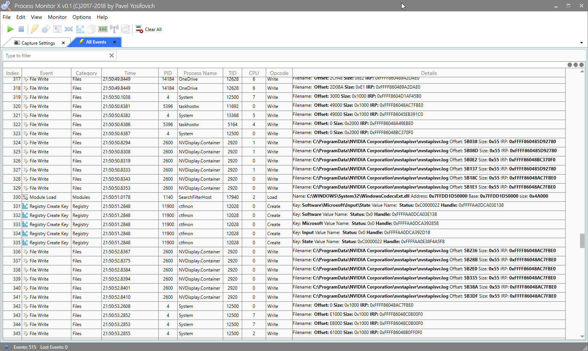

# ProcMon vs. ProcMonX
The (now classic) [Process Monitor](https://docs.microsoft.com/en-us/sysinternals/downloads/procmon) tool from [Sysinternals](https://docs.microsoft.com/en-us/sysinternals/) allows watching important activities on a system: process and thread creation/termination, image loading/unloading, file system operations and registry operations (and some profiling events). This tool helped me many times in diagnosing issues or just understanding what's going on in a particular scenario.

Yesterday I released the first preview of a tool called [Process Monitor X](https://github.com/zodiacon/ProcMonX) (ProcMonX), as a possible alternative to ProcMon. ProcMonX provides information on similar activities to ProcMon, but adds many more events, such as networking, ALPC and memory. In fact, the number of possible events is staggering, since there are many events exposed by the NT kernel provider, and the tool could be expanded to include other providers. So why doesn't ProcMon provide the same range of events?

**ProcMon** works by using a kernel driver. The upside to using a driver is the ability to get the most accurate data, since some form of hooking is involved. Here is a list of events and the way ProcMon gets to the data (I have not actually seen the source code, but that's how I would have implemented it):

* Process creation/termination - Use the [PsSetCreateProcessNotifyRoutineEx](https://msdn.microsoft.com/EN-US/library/windows/hardware/ff559953(v=vs.85).aspx) function to hook process creation and termination. The full command line is available to the callback along with creating thread/process.
* Thread creation/termination - Use the [PsSetCreateThreadNotifyRoutine](https://msdn.microsoft.com/en-us/library/windows/hardware/ff559954(v=vs.85).aspx) function with a callback invoked for every thread creation or termination.
* Image loading/unloading - Use the [PsSetLoadImageNotifyRoutineEx](https://msdn.microsoft.com/en-us/library/windows/hardware/mt826267(v=vs.85).aspx) to register a callback for such notifications.
* Registry events - Use the [CmRegisterCallbackEx](https://msdn.microsoft.com/library/windows/hardware/ff541921) function to register callbacks for pre and post operations. Every possible registry operations can be hooked - before the operation and afterwards. This is how ProcMon knows how the operation completed.
* File system operations - Use a [file system mini filter](https://docs.microsoft.com/en-us/windows-hardware/drivers/ifs/file-system-minifilter-drivers), to hook pre and post file system operations. 

With this approach, adding new functionality is really difficult. For example, to get network-related events, one would have to write some sort of NDIS filter or perhaps use the [Windows Filtering Platform](https://msdn.microsoft.com/en-us/library/windows/desktop/aa366510(v=vs.85).aspx) (WFP), both of which are far from trivial. Other types of operations such as memory allocation events is nearly impossible to get since these cannot really be hooked.

ProcMonX, on the other hand, uses [Event Tracing for Windows](https://docs.microsoft.com/en-us/windows-hardware/drivers/devtest/event-tracing-for-windows--etw-) (ETW), a diagnostics and logging mechanism that existed since Windows 2000. In ETW, providers spit out events that ETW consumers consume. These events can be logged to a file (.ETL extension) and then analyzed, or alternatively sent in real-time to listening consumers.

**ProcMon** does use ETW events for its network-related information. You can verify that by looking at the call stack for a network event.

Windows provides many providers out of the box, each exposing a rich set of events. To get a sense of the number of providers use **logman query providers** in a command window.

ProcMonX creates a real time session (no automatic logging to file) and registers for the events the user requests (the current list is small, more events will follow in subsequent versions). The event data is displayed as they come in.

Is it better than using kernel drivers? Not generally. Hooking with a driver is always more reliable and accurate. ETW has an inherent delay of one to three seconds when reporting events, which is not a big deal for this kind of tool, since the events are still ordered correctly and have correct enough time stamps (if using the same ETW session).

All this means is that **ProcMonX** sacrifices some accuracy and in some cases pieces of information to get in exchange a huge arrange of events that could not be possible with ProcMon. Additionally, I am trying to get a comfortable and powerful UI to filter, view and inspect information. This is naturally a work in progress, but it's important to emphasize. ETW traces can be captured and analyzed with a myriad of tools, such as [PerfView](https://github.com/Microsoft/perfview/releases), [Windows Performance Recorder](https://docs.microsoft.com/en-us/windows-hardware/test/wpt/windows-performance-recorder) / Analyzer, and others. With a wealth of information there is a necessity to be able to filter, find and analyze the results.

I hope you find the tool useful, feel free to leave comments and bug reports on the Github repo. And of course - pull requests are accepted!